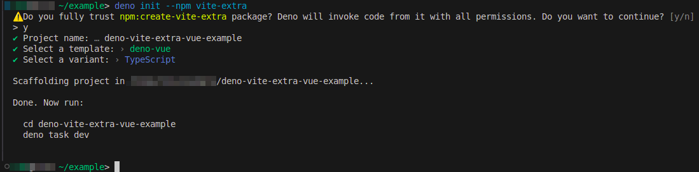
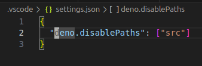

1. Using
   [https://github.com/bluwy/create-vite-extra](https://github.com/bluwy/create-vite-extra)
   init project

   - with deno latest api it can be `deno init --npm vite-extra`
   - choose `deno-vue`, `typescript`
   - 

2. Disable `deno` for `src` folder in `.vscode/settings.json`

   - 
   - _i suppose that in situation with `vue` the ts-language server (not
     deno-ts) is expected and that's is why i did this step => to allow vscode
     have all intelligence and autocompletion stuff_
   - so simply speaking this is not related to real code, only for colors in
     vscode

3. In `deno.json` add `nodeModules: "auto"`
   - install any dependency with deno. For example: `deno add npm:pinia`

## Current project as it is on deno deploy
[https://vite-extra-vue.deno.dev/](https://vite-extra-vue.deno.dev/)
